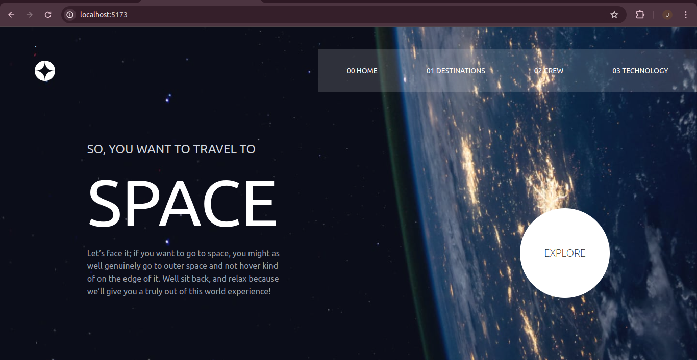
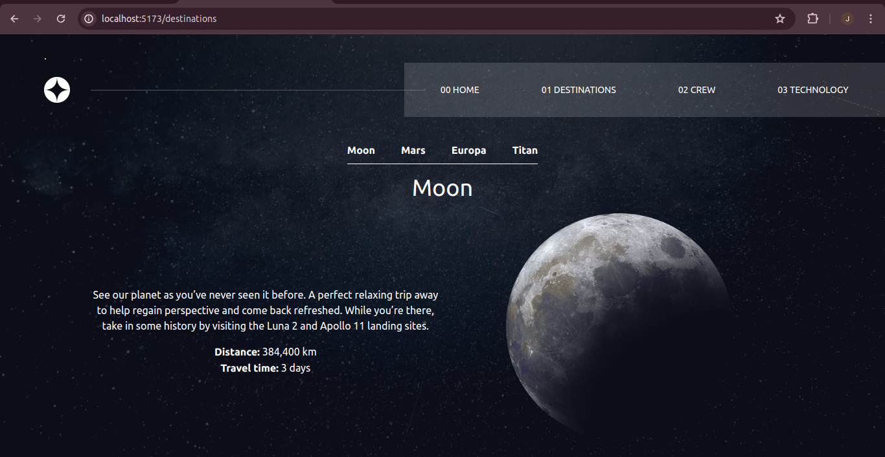
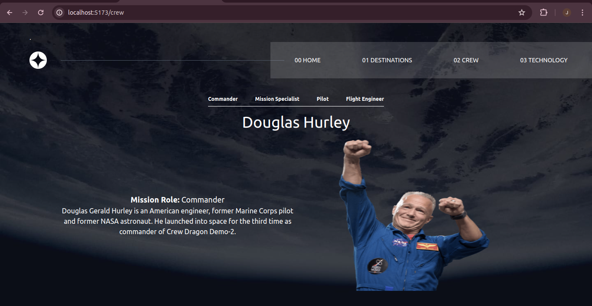
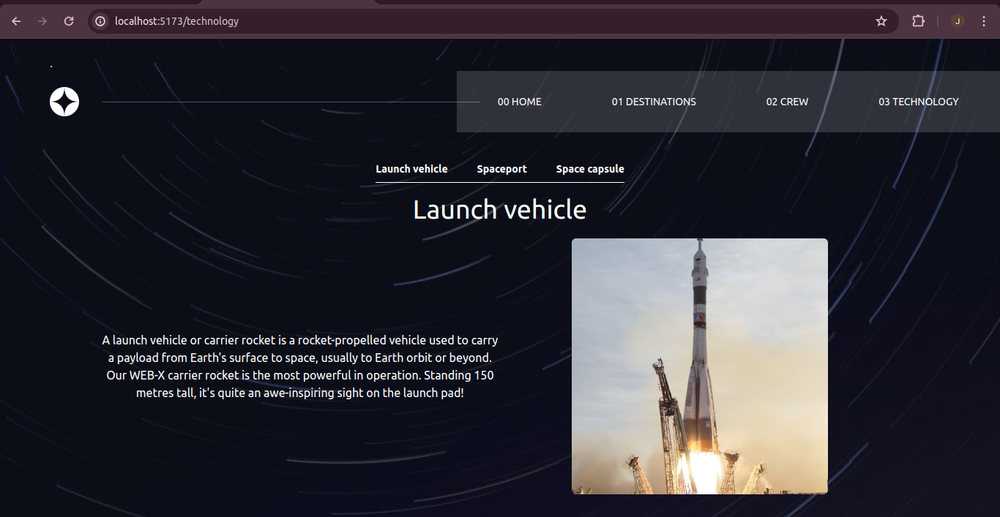

# Frontend Mentor - Space tourism website solution

This is a solution to the [Space tourism website challenge on Frontend Mentor](https://www.frontendmentor.io/challenges/space-tourism-multipage-website-gRWj1URZ3). Frontend Mentor challenges help you improve your coding skills by building realistic projects. 

## Table of contents

- [Overview](#overview)
  - [The challenge](#the-challenge)
  - [Screenshot](#screenshot)
  - [Links](#links)
- [My process](#my-process)
  - [Built with](#built-with)
  - [What I learned](#what-i-learned)
  - [Continued development](#continued-development)
  - [Useful resources](#useful-resources)
- [Author](#author)
- [Acknowledgments](#acknowledgments)

**Note: Delete this note and update the table of contents based on what sections you keep.**

## Overview

### The challenge

Users should be able to:

- View the optimal layout for each of the website's pages depending on their device's screen size
- See hover states for all interactive elements on the page
- View each page and be able to toggle between the tabs to see new information

### Screenshot






### Links

- Solution URL: [https://github.com/njeruthuo/Space-tourism-website](https://github.com/njeruthuo/Space-tourism-website)
- Live Site URL: [Add live site URL here](https://your-live-site-url.com)

## My process

### Built with

- vite
- Flexbox
- CSS Grid
- TailwindCSS
- React router
- Semantic HTML5 markup
- CSS custom properties
- Mobile-first workflow
- [React](https://reactjs.org/) - JS library
- [Styled Components](https://styled-components.com/) - For styles


### What I learned
This is by far the best frontend challenge Ive done from frontend mentor. It pushes to the absolute limits.

```js
/** @type {import('tailwindcss').Config} */
export default {
  content: ["./index.html", "./src/**/*.jsx"],
  theme: {
    extend: {
      backgroundImage: {
        "home-desktop": "url('/src/assets/home/background-home-desktop.jpg')",
        "home-tablet": "url('/src/assets/home/background-home-tablet.jpg')",
        "home-mobile": "url('/src/assets/home/background-home-mobile.jpg')",
        "destinations-desktop":
          "url('/src/assets/destination/background-destination-desktop.jpg')",
        "destinations-tablet":
          "url('/src/assets/destination/background-destination-tablet.jpg')",
        "destinations-mobile":
          "url('/src/assets/destination/background-destination-mobile.jpg')",
        "crew-desktop": "url('/src/assets/crew/background-crew-desktop.jpg')",
        "crew-tablet": "url('/src/assets/crew/background-crew-tablet.jpg')",
        "crew-mobile": "url('/src/assets/crew/background-crew-mobile.jpg')",
        "technology-desktop":
          "url('/src/assets/technology/background-technology-desktop.jpg')",
        "technology-tablet":
          "url('/src/assets/technology/background-technology-tablet.jpg')",
        "technology-mobile":
          "url('/src/assets/technology/background-technology-mobile.jpg')",
      },
    },
  },
  plugins: [],
};

```

App.jsx
```
import { Route, Routes, useLocation } from "react-router-dom";
import { Crew, Destinations, Home, Navbar, Technology } from "./components";

const App = () => {
  const location = useLocation();

  const getBackgroundClass = () => {
    switch (location.pathname) {
      case "/":
        return "bg-home-mobile md:bg-home-tablet lg:bg-home-desktop";
      case "/destinations":
        return "bg-destinations-mobile md:bg-destinations-tablet lg:bg-destinations-desktop";
      case "/crew":
        return "bg-crew-mobile md:bg-crew-tablet lg:bg-crew-desktop";
      case "/technology":
        return "bg-technology-mobile md:bg-technology-tablet lg:bg-technology-desktop";
      default:
        return "bg-home-mobile md:bg-home-tablet lg:bg-home-desktop";
    }
  };
  
  return (
    <div
      className={`min-h-screen text-white bg-no-repeat bg-cover ${getBackgroundClass()}`}
    >
      <Navbar />

      <Routes>
        <Route element={<Home />} path="/" />
        <Route element={<Destinations />} path="/destinations" />
        <Route element={<Crew />} path="/crew" />
        <Route element={<Technology />} path="/technology" />
      </Routes>
    </div>
  );
};
export default App;

```


### Continued development
This project is done and dusted!!!

## Author

- Website - [https://frontend-portfolio-amber.vercel.app/](https://frontend-portfolio-amber.vercel.app/)
- Frontend Mentor - [@njeruthuo](https://www.frontendmentor.io/profile/njeruthuo)
- Twitter - [@njeru19_njeru](https://www.twitter.com/njeru19_njeru)